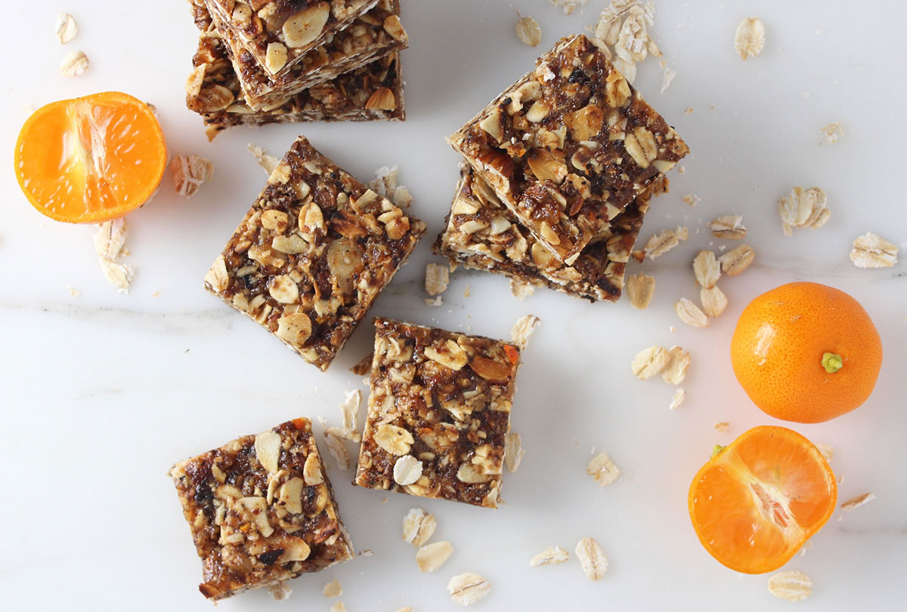

# ProjectStoreGame
Верстка сайта построена на модуле CSS Flex Box. Проект адаптирован под мобильные устройства. Применена технология One Page Scroll. В форме заказа реалезована валидация полей при заполнении которых отправляется асинхронный запрос на сервер и в зависимости от ответа сервера появляется модальное окно с успешным или не успешным ответом. Готовый проект при помощи gulp собран в папку docs. Для его просмотра, перейдите по [ссылке](https://artemkis.github.io/ChoccoTutorial/)


## Инструкция по сборке проекта

1. Cклонируйте репозиторий: 

   ```git clone https://github.com/artemkis/ChoccoTutorial.git```

2. Установите все npm пакеты:

   ```npm i```

3. В командной строке терминала введите команду npm run build и проект соберется в папку docs.
